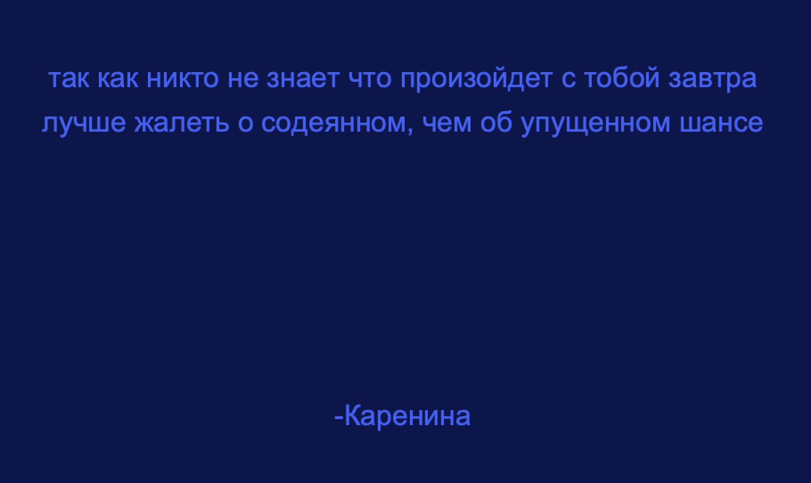
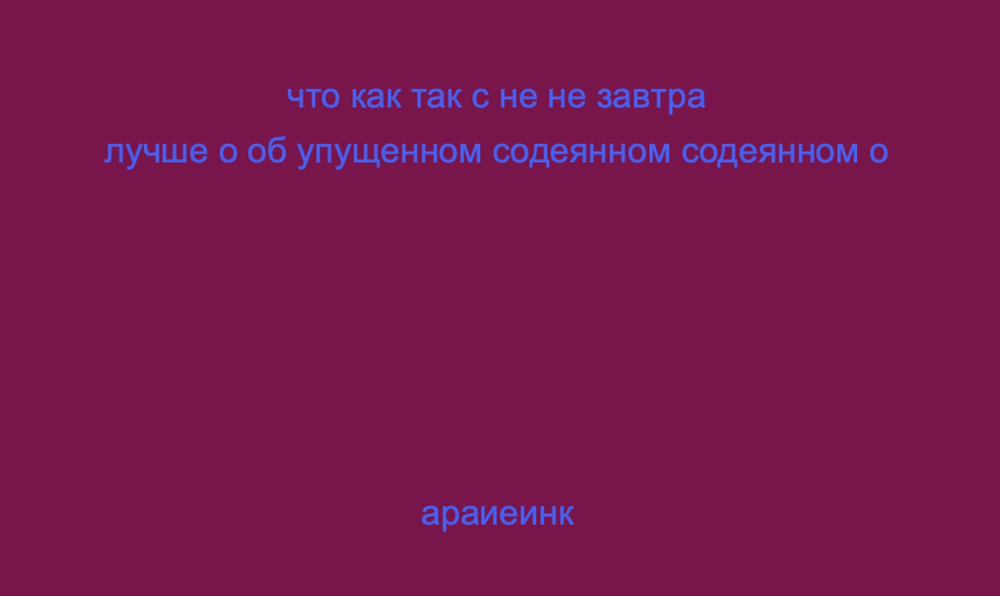

***Generative Text***

For this assignment we were supposed to make either data visualization or generative text. At the beginnign I tried to make data vizualization of meteorite landing, however it didnt work as I was expecting so then I tried to make generative text. I chose a Russian poem, and decided to randomly generate words so it would completely change the meaning of the poem to something different. 

Here is the poem I chose: 

"лучше жалеть о содеянном чем об упущенном шансе,так как никто не знает что произойдет с тобой завтра"
 ---Каренина (name of the author)
 
  
It basically means that it’s better to regret the deed than the missed chance, since no one knows what will happen to you tomorrow. 

 
 
  
 
 
 
[Here](https://youtu.be/Dp9oBNTKKnw) is the video of my project
 

 
The challenge that arose while working on this project was changing background after each time mouse is pressed. I tried some different things but it didnt work, so I decided to oout different background at the beginning and just change the background once while the mouse is pressed for the first time. 
Because of this online classes, its difficult to understand some small details via zoom and I am still struglling with processing, however I hope that with more practice I will do better. 
