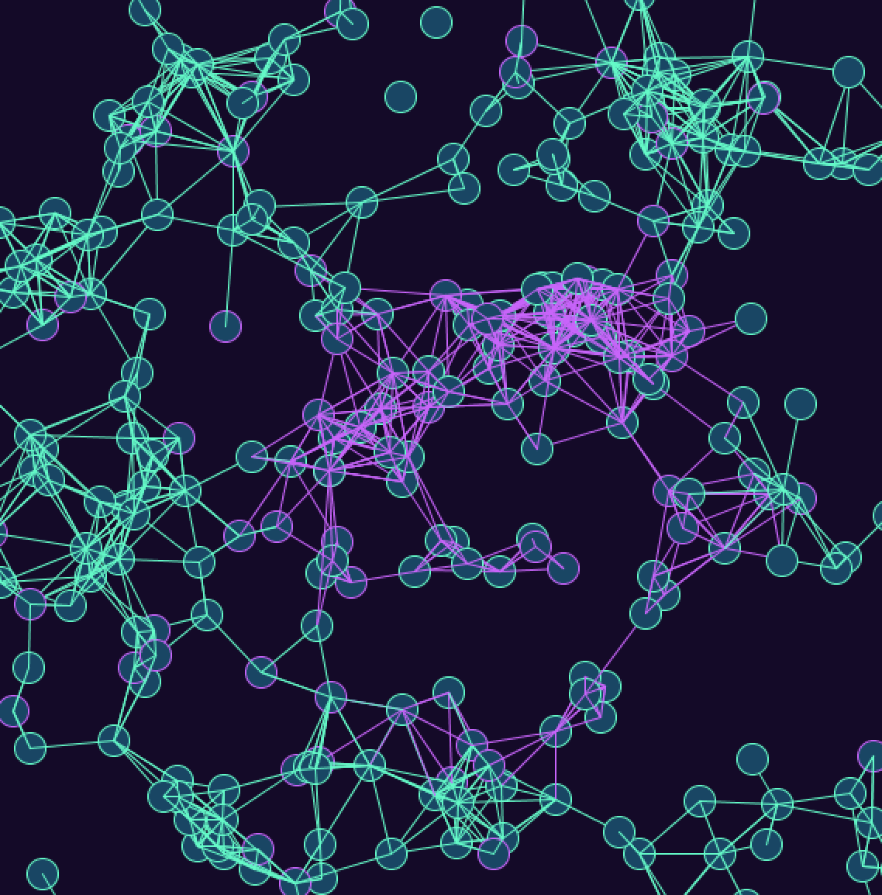

***Experiment***

For this assignment we were supposed to experiment with Professor's Aaron example that he showed us during our last class. I tried to mess around with code and change a lot of things, as an example acciliration, or adding ellipse, speed and etc. It was a very fun and interesting project to work on. Some challenges though arose during working on ths project; I tried to change the speed to 2 and it was very fast and in like 5-6 seconds it disappeared, I didnt understand why that happened, probably it was very fast? 

[Here](https://youtu.be/SXG76Bvy_3c) is the video when speed* = 2

I tried adding circles and it ended up pretty interesting

[Here](https://youtu.be/3Bmx-XvgKmE) is the video with cirlces

I made three different versions and the last is without any circles, which I really liked

[Here](https://youtu.be/dHmKpCITS4Y) is the video without cirlces

Images 

 
 
 

