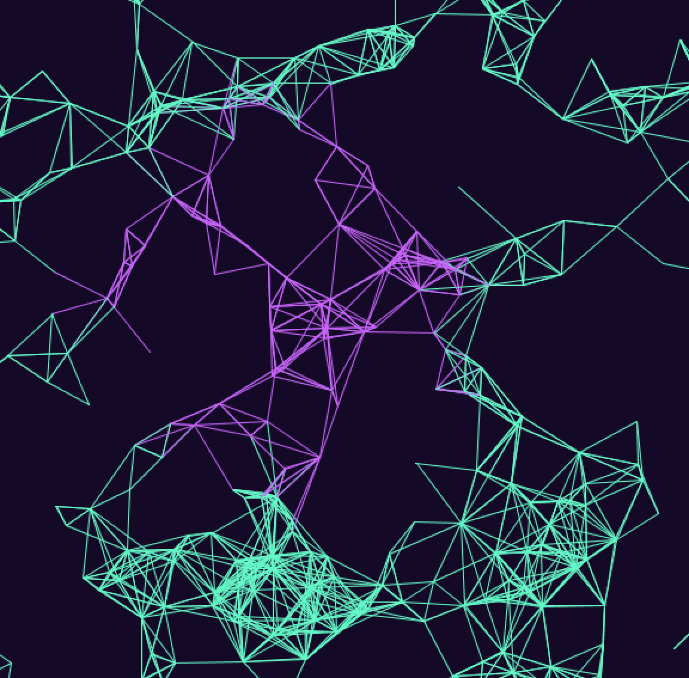

***Experiment***

For this assignment we were supposed to experiment with the example of Professor Aaron who showed us during our last class. I tried to mess around with code and change a lot of stuff, as an example acciliration, or add ellipse, speed and etc. I really enjoyed working on this project, it was very fun and interesting experience. Some challenges though arose during working on ths project; I tried to change the speed to 2 and it was very fast and strokes disapperaed in about 5-6seconds, I didnt understand why that happened, probably the speed was very fast? 

[Here](https://youtu.be/SXG76Bvy_3c) is the video when speed* = 2

I tried to add circles and it ended up quite interesting

[Here](https://youtu.be/3Bmx-XvgKmE) is the video with cirlces

I made three different versions and the last is without any circles, which I really liked

[Here](https://youtu.be/dHmKpCITS4Y) is the video without cirlces

 

