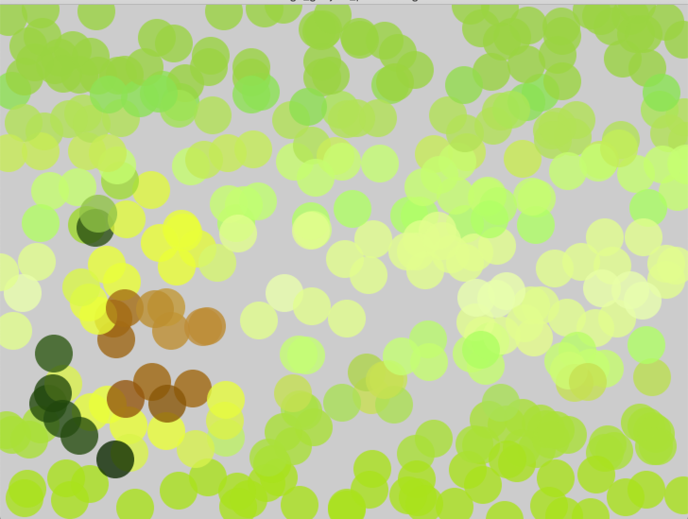

***Flashlight effect & Pointillizm***

For this assignment I tried mixing flashlight effect and pointilizm. More specifically, if the mouse is on the canvas but is not pressed -> pointilize. If the mouse is on the canvas and is pressed -> then the flashlight effects appears and makes the whole area black but not the mouse area
             
Challenging part: The flashlight effect is working, however its not moving with the mouse, so whenever the mouse is pressed -> flashlight light is working. I wanted the flashlight to move with the mouse and only pointilize the part where the mouse is and make other parts of the canvas black. However, now when the mouse is pressed,both of them are working; flashlight and pointilize. And when you press the mouse multiple times flashlight dissappears and pointilize the whole canvas.
 
### Images

**[Link to Video] https://youtu.be/T-PQX2nzIok**

### References: http://learningprocessing.com/examples/chp15/example-15-09-FlashLight
