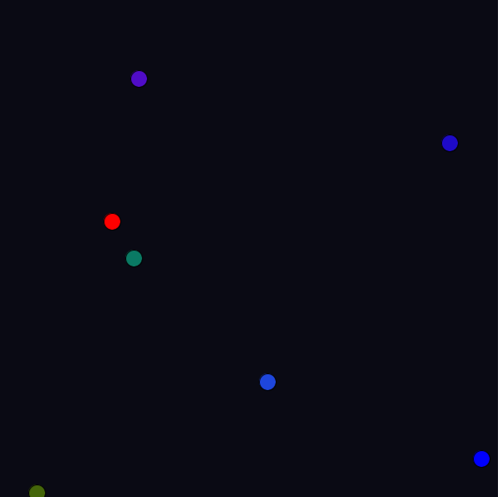

***Artwork using Object Oriented Programming***

For this assignment we were supposed to create either an artwork or a game using Object Oriented Programming. It took me a lot of time to decided between creating some art work or a game but then I finally decided to make an artwork and called it "State of Mind". You would wonder why "State of Mind"? At this point during this pandemic where everyone is literally going crazy, including myself, I decided to show the state of mind by making small boxes go all around the screen from one angle to another. Where everything is just falling apart but we cant do anything, but there are some good and bad things that are happening during this pandemic. 

In total I used 7 boxes and gave each different speed. As an example I made one of them super fast, and its the one when we are very happy and energetic another one is very slow and its for the one when we are very sad and depressed different ones are in between this two states.

[Here](https://youtu.be/gm9BW7vWAV4) is the video of my beautiful masterpiece

Overall it was a very fun project to work on, luckily I didnt face any challenges while working on it which I am very happy of. 

