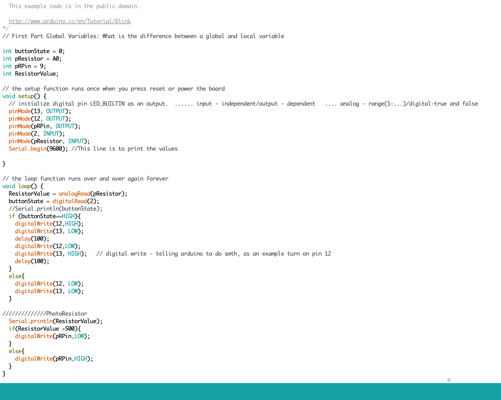

** circuit with Arduino that combines multiple digital inputs and outputs **

I decided to use photoresistor and button to control LED. I used two LED’s for button and one LED for photoresistor. When you press the button the LED's start blinking one after each other, I kind of wanted to do the ambulance lights, where they blink one by one. And the other LED works with photoresistor, when there is light the LED turns on and when you cover photoresistor the LED turns off. 

Here is the schematic of my circuit 

[Here](https://youtu.be/47wNioMuzHE) is the first video of my wonderful project
[Here](https://youtu.be/47wNioMuzHE) is the second video of my wonderful project 

Here is my code 

I guess the challenging part was writing a code in Arduino since at the beginning I was very confused by all the things I was doing, however, after going one by one and googling the meaning of each code, I kind of figured out the logic behind it. 
