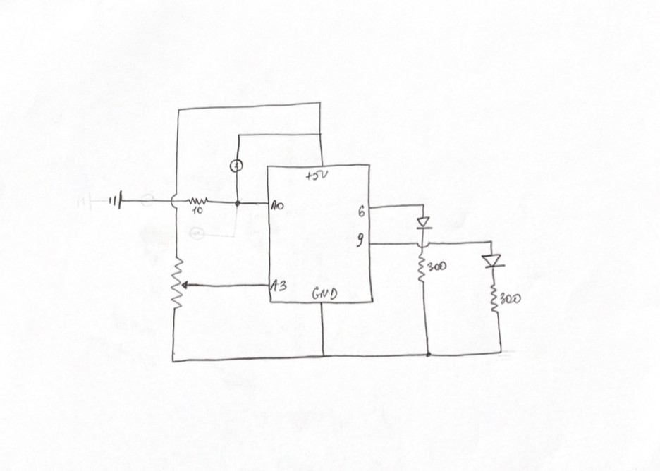

***Digital and Analog sensors***

For this assignment I decided to use two LED's controlled by potentiometer and photoresistor.
The LED is connected to analog output and by turning the potentiometer you can control how bright the LED will light up. And the other LED lights up when you use photoresistor. 

Here is the schematic of my circuit

[Here](https://youtu.be/47wNioMuzHE) is the first video of my wonderful project

I had a lot of with this projects, but at the same time it was challenging since I am new to code. 
