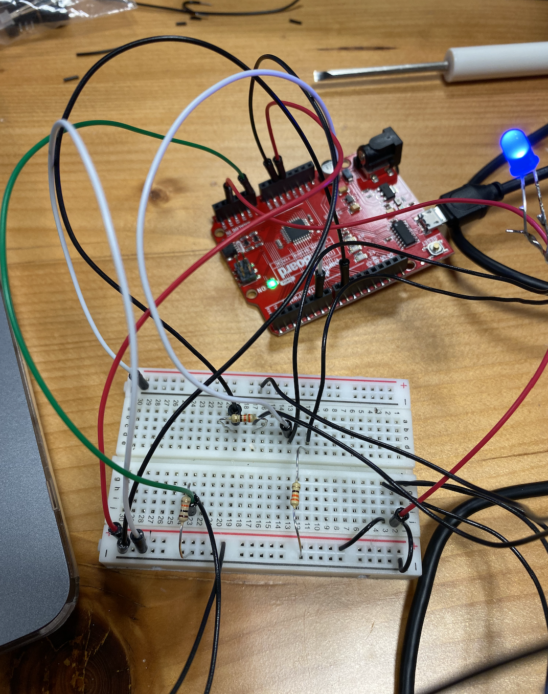
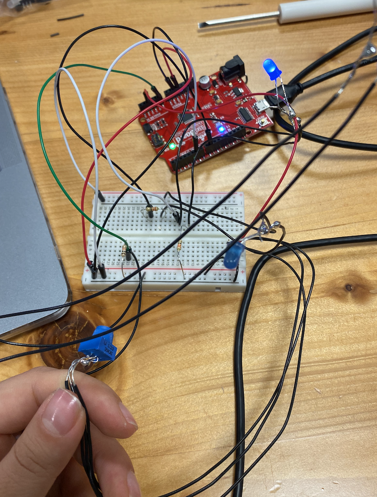

***Digital and Analog sensors***

For this assignment I decided to use two LED's controlled by potentiometer and photoresistor.
The LED is connected to analog output and by turning the potentiometer you can control how bright the LED will light up. And the other LED lights up when you use photoresistor. At first I wanted to use a teddy bear and make two LED's as its eye and attach potentiometer on one hand and photoresistor on the other, however, I couldn't find any tiny teddy bears so decided to go with the toy that I found in the IM Lab, there were two ... next to its feet so I decided to put my LED's there, and there was also ... eyes, so I put photoresistor there and potentiometer on the back side of its head. I also did some soldering, since I put everything inside of the toy, and the wires that we were using are too short, so I decided to solder some longer wires, in order to be able to put my LED's, potentiometer and photoresistor inside of the toy. 

Here is the schematic of my circuit

Here are the photos of the circuit 

[Here](https://youtu.be/mP68UGV3s5g) is the first video of my wonderful project

I had a lot of fun with this projects, but at the same time coding part was very challenging and nerve wrecking, since I am new to code. 
