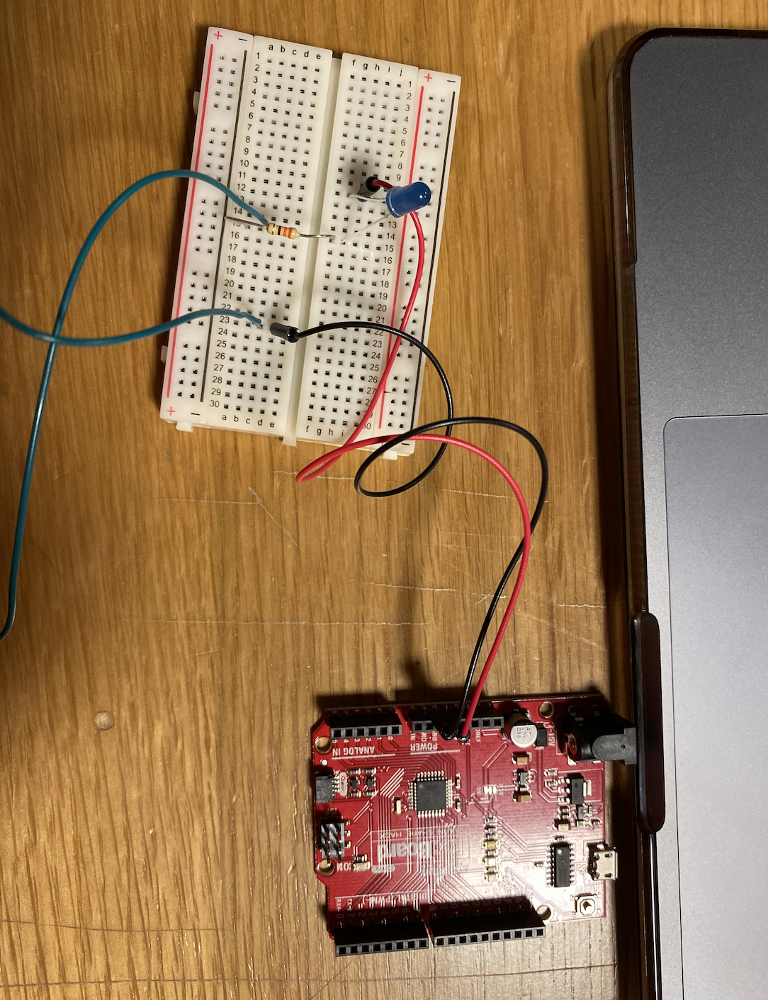

**Here is the description of my hands free switch**

For this assignment I decided to make a switch where you turn on LED’s while dancing, in the feet dancing arcade game. I used a cardboard and drew two shoe size figures, and put coper tape on it. I had 2 LED’s and in total three wires, I attached the first one to the cardboard and the other two to my shoes, and I tried playing the feet dancing arcade game, whenever your shoes touch the cardboard, LED’s light up.
After finishing with the first one, I had an idea of using my laptop as a switch. For this one I only used one LED and two wires, one of the wires I connected in the top of my laptop another on the bottom, and whenever I close my laptop, LED’s light up. 

Here is my image

[Here](https://youtu.be/Ed8VjfYeGWE)is the first video

I almost didn’t have any problems with the first idea, however with the second the problem was that I had a cover on my laptop so whenever I closed my laptop, the cover would stop wires from touching each other, so then I decided to move wires and adding a bit of more copper tapes on top, which eventually helped and the switch worked. 

[Here](https://youtu.be/HNtE616FWMY) is the second video
