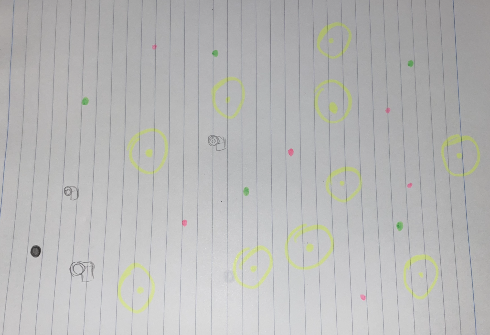
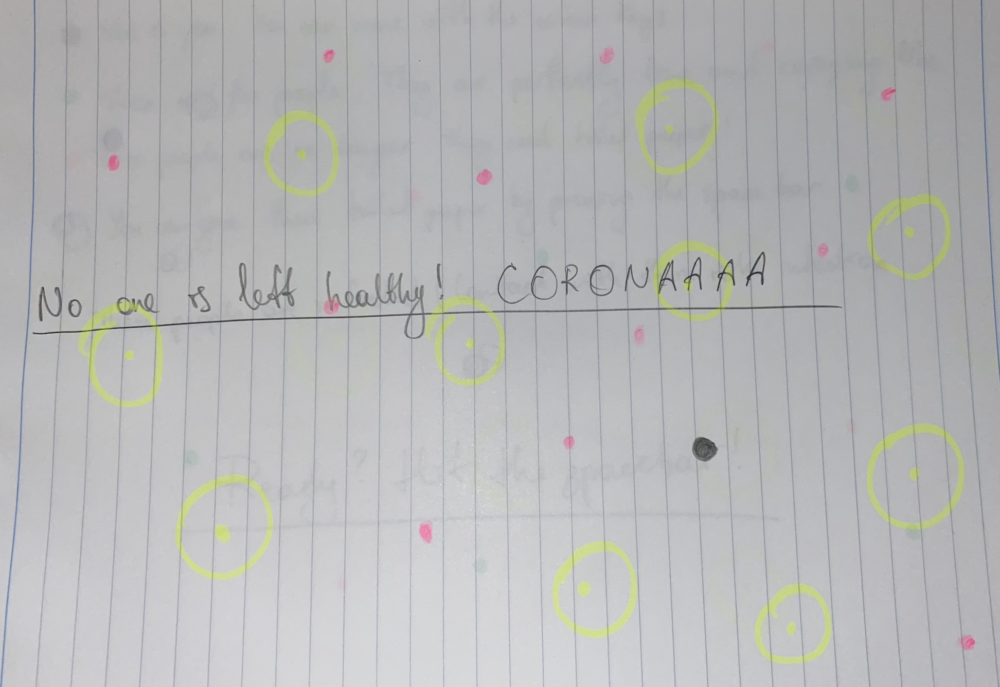

***Corona Timeeeee***

For our final project, we had to create anything on Processing. Since we could do anything, I thought of making something related to Covid-19. I decided to make a game in which I wanted to show how important and dangerous this virus is, however, at the same time make it interesting and fun. 

Next steps: 

- start coding
- add: background image/song
