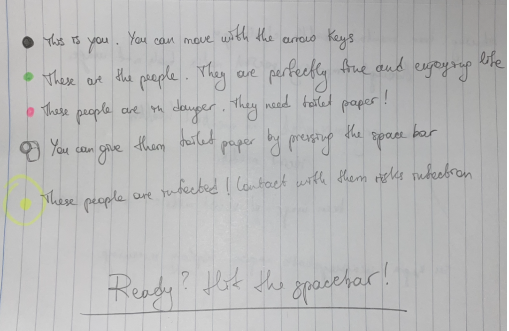
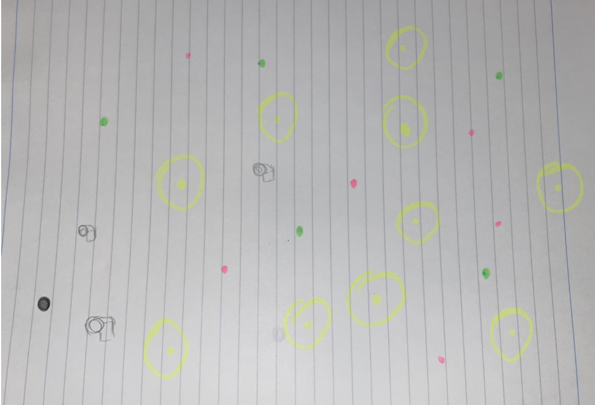
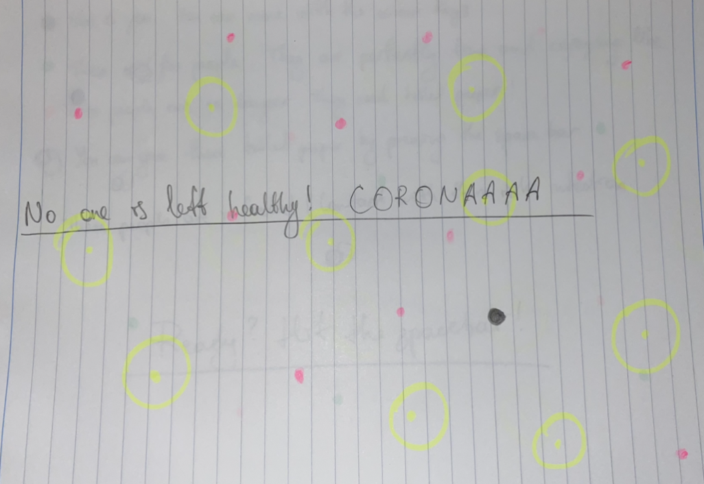

***"CORONA" - shooting game***

For our final project, we had to create anything on Processing. At the beginning it was hard to choose one thing since the project was free to choose. After brainstorming different ideas, I thought of making a game that would somehow be related to Covid-19. By making a corona based game, I wanted to show how important and dangerous this virus is, however, at the same time make the game interesting and fun to play. The first thing that I did was make some sketches so I would have the general idea on what I am going to make.

### Initial idea

This is the idea that I had at the beginning, however, after starting to code,the concept of the game has shifted a bit. Instead of saving people by spreading toilet papers, I decided to make something similar to a shooting game, where a player shoots the enemy which in this case would be the virus. 

### [Link to Video]

### Images

 ***Explanation:***
 - Player can move only left or right with moving the mouse 
 - Player can shoot enemies with pressing the mouse, however, when the mouse is not pressed -> player just stays in its position 
- Enemies start coming automatically/randomly when the game begins
- Player can shoot enemies with bullets and to make the game more difficult I decided enemies to shoot into the player as well 
 - When the player shoots the enemy -> enemy automatically disappears but still the bullets come down 
 - When you shoot the enemy - one second automatically adds up into the count up timer 
 - I didnt want the game to be simple, so in order to make it even more difficult, I decided add "lives" as well, so the player has 5 lives -> when the enemy shoots the player - minus one live
 - In order to make the game engaging and interesting to play, I decided to add a score button
 - Count up time - in total 30 seconds -> when the timer reaches 10 seconds -> the color of the timer and the score becomes red to notify the player that the game will end soon 
 
 
***Challenging  Parts:***
- Writing code for the GameOver screen was very time consuming since, it kept showing the GameOver screen only once at the beginning, and when you play the game for the second time, it automatically kept restarting it without even showing the screen. After the meeting with the professor, the issue was resolved.
- Problems with "lives”: whenever enemy shoots the player -> minus one live. I tried so many different ways to solve the issue, but it didn't work, then I found a youtube tutorial, which helped me a lot in resolving the issue.

 
Although there have been some challenges that have arisen throughout the projects, the end product came very close to what I foresaw for my final project and I am extremely pleased with the overall work I have done in this course of the challenging time. 
 
 
### References
https://www.youtube.com/watch?v=wOc2g0rlh3I 

https://processing.org/reference/keyReleased_.html

 
