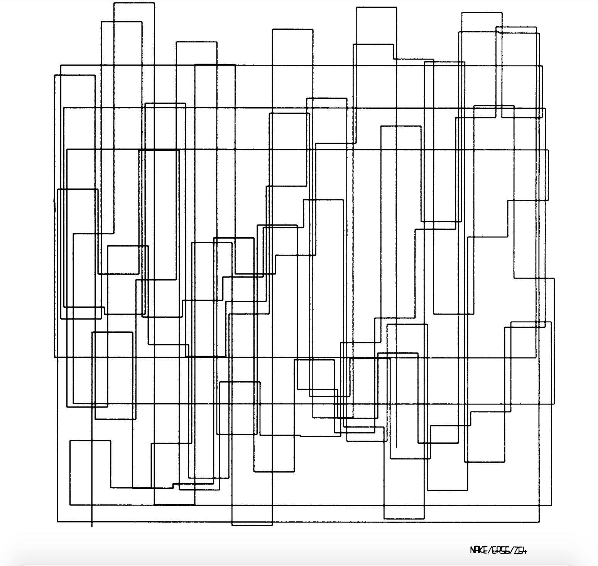
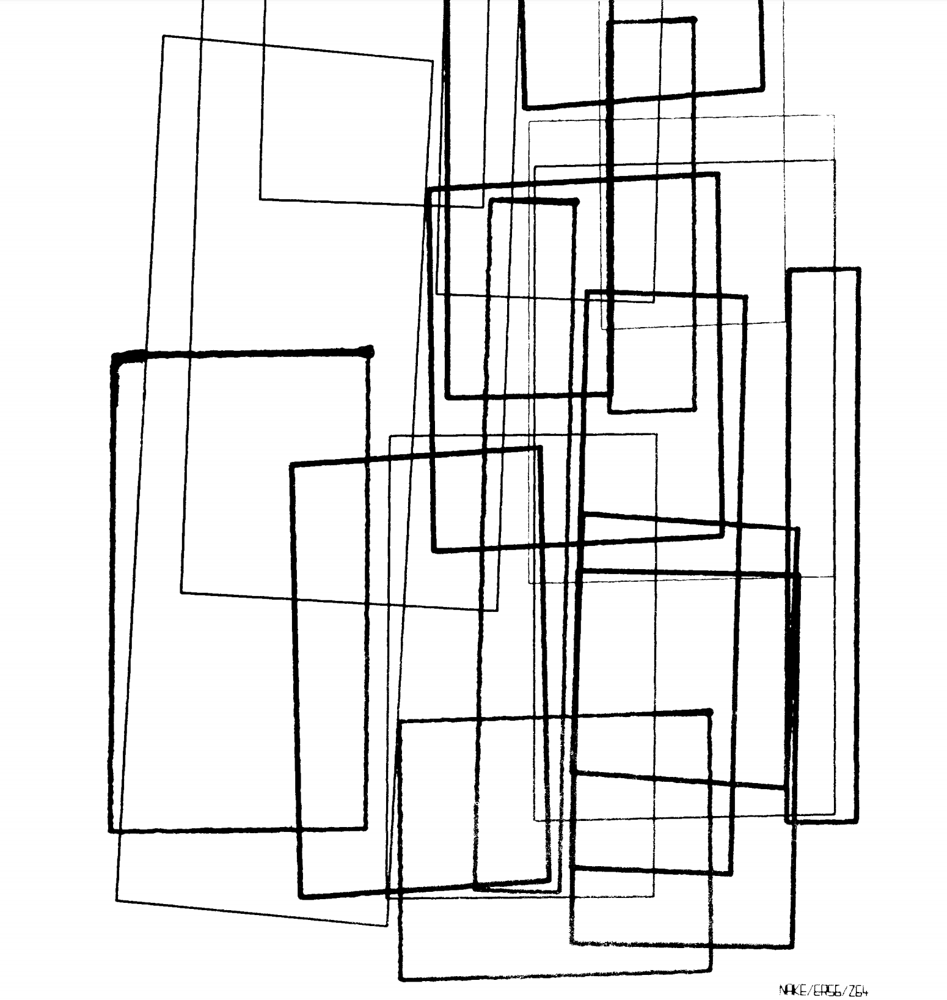
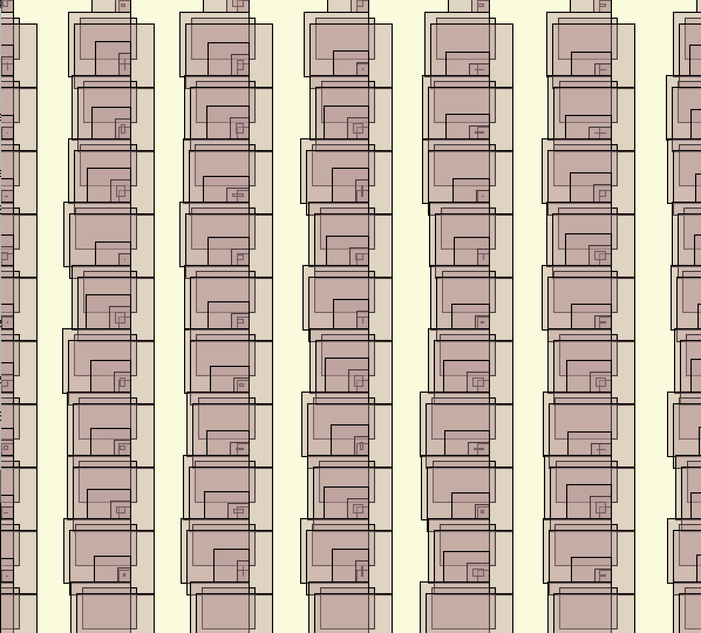

***Computer Graphics Art***

For this assignment we were supposed to create a computer generative art. It was challenging to come up with an idea to recreate an old computer art from an issue of “Computer Graphics and Art”. Finally I found some pieces that I really liked and took inspiration from. 

I decided to make something similar yet at the same time different. I was adding different squares on top of each other, and luckily they came up pretty good. At the beginning I only used two colors black and white, however after finishing with making boxes I decided to change the "mood" of my project by using some bright colors.

At first when you see the piece it looks very simple, however it was very time consuming since I am still new to processing. However, luckily I didnt encounter any big challenges while working on this project. Even it was time consuming I enjoyed working on it, designing part and also making different size of boxes that would go together. 
