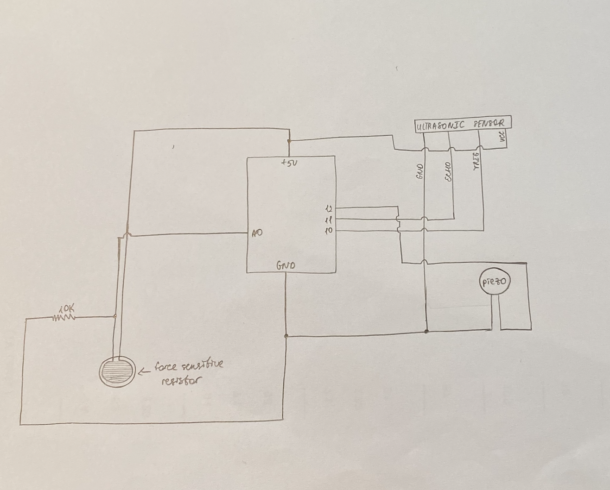
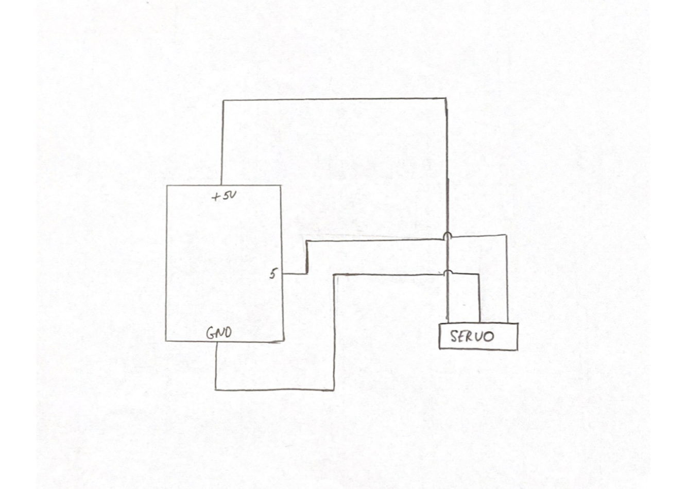

***Musical Instrument***

For this project I decided to do make two different instruments. 

1) Arduino instrument that makes different sounds - from note C to B: 

I used one ultrasonic sensor to measure the distance, one piezo buzzer to produce a sound and one force sinsitive resistor to detect pressing, and also one 10K resistor, around 8-10 jumper wires, solderless breadboard and arduino. The way the instrument works - when you press on the force sensitive resistor, the arduino activates the ultrasonic sensor, and depending to its measure, the piezo will play different notes. To play the instrument you can use one hand to press the force sensitive resistor and hold the other in front of the ultrasonic sensor, to play different notes. 

Here is the photo of the circuit

[Here](https://youtu.be/mP68UGV3s5g) is the video of my wonderful project

2) Arduino Drum:

I used one servo motor, around 5 jumper wires, solderless breadboard, arduino, drum (I used a small drum insturment with drum stick which I found in IM lab - you can find the photo below) and masking tape. I tapped the drum stick to the servo horns and servo motor to the drum to hold them in palce. Once everything was ready to go, I started coding. 

Here is the photo of the circuit 

[Here](https://youtu.be/mP68UGV3s5g) is the video of my wonderful project
