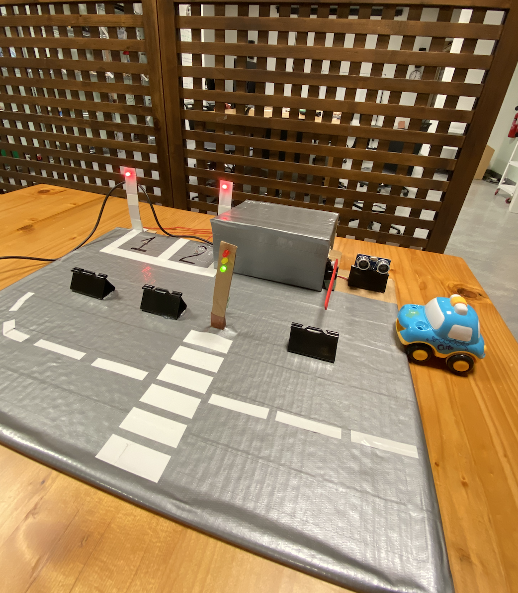

***Car Parking System***

For my midterm project I decided to use: distance measuring sensor, servo motor, LED's and photoresistor. It was somewhat challenging to come up with the project where I could use all the I/O that we have learned so far, however, after brainstorming I decided to make a car parking system with road and traffic light on the side. I used a cardboard, and decorated it with a duct tape. On the right side, I made a car barrier using distance measuring sensor and servo motor. I also made two parking spaces and used two LED's and two photoresistors to control the light-keeping the LED on and turning off automatically when the car arrives in. On the left side of the cardboard I made a road and crosswalk using duct tape and also put traffic light using LED's. 

In order to build an Arduino Traffic Light Controller, I used:
- 3 x 330k resistor
- red, yellow and green LED's
- a breadboard
- wires

In order to make Automatic Smart Car Barrier System I used:
- distance measuring sensor
- servo motor
- wires
- a breadboard 
- paper clip 

In order to make LED's controlled with photoresistor I used:

- 2 LED's
- 2 photoresistors
- 2 x 10K ohm resistors
- 2 x 330k resistors
- wires
- a breadboard

Here is the photo of my project

Here is the schematic of the circuit 

Here are the photos of the circuit 

[Here](https://youtu.be/gnPDiSqWJoc) is the video of my wonderful project

I decided to write the code in three separate files at the beginning; for traffic light, car barrier and LED's that are being controlled with photoresistors. And then I decided to put all of them in one file, which was very challenging, after making sure that each of my code works perfectly. I used delays to control the LED's, so when I put all of my codes together, my project didnn't work, as an exampe - I wrote a delay inside the void loop to control LED, however at the same time, the car barrier was getting LED's delay. That's why getting all of the codes together at first place was difficult. Afterwards, however, I chose not to use delay and instead use "if" / "else if", which changed the whole subject completely and made my work so much easier. It also took a lot of time to design the project - hot glueing parts, making a stand for attaching LED's and designing the board overall. However, I am very happy with the project that I created for such a short period of time. 
