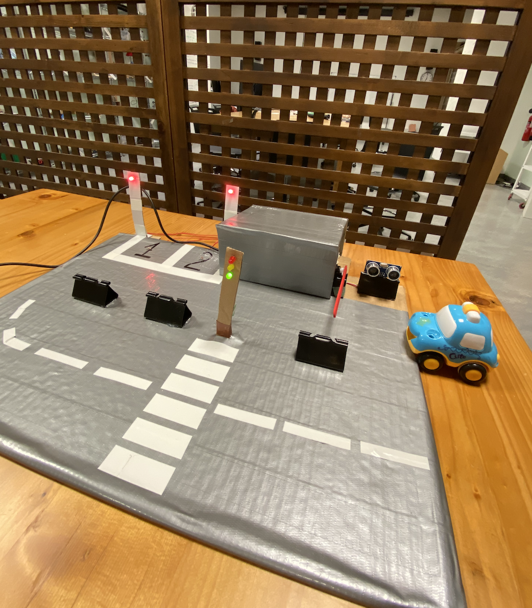
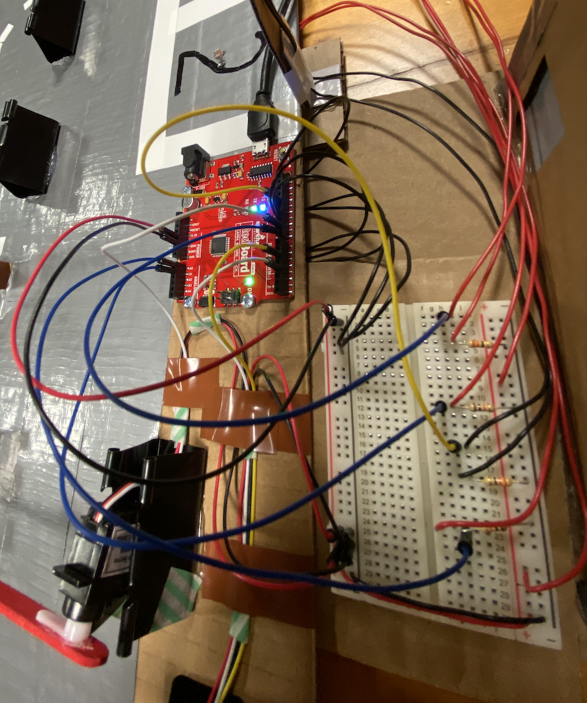
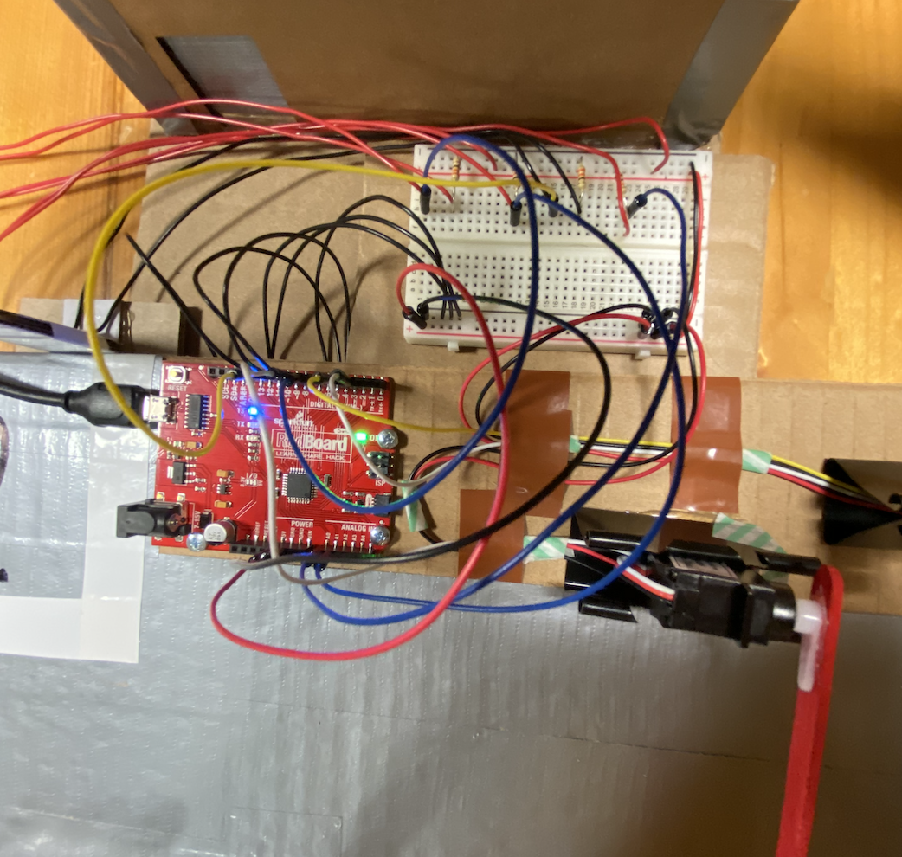
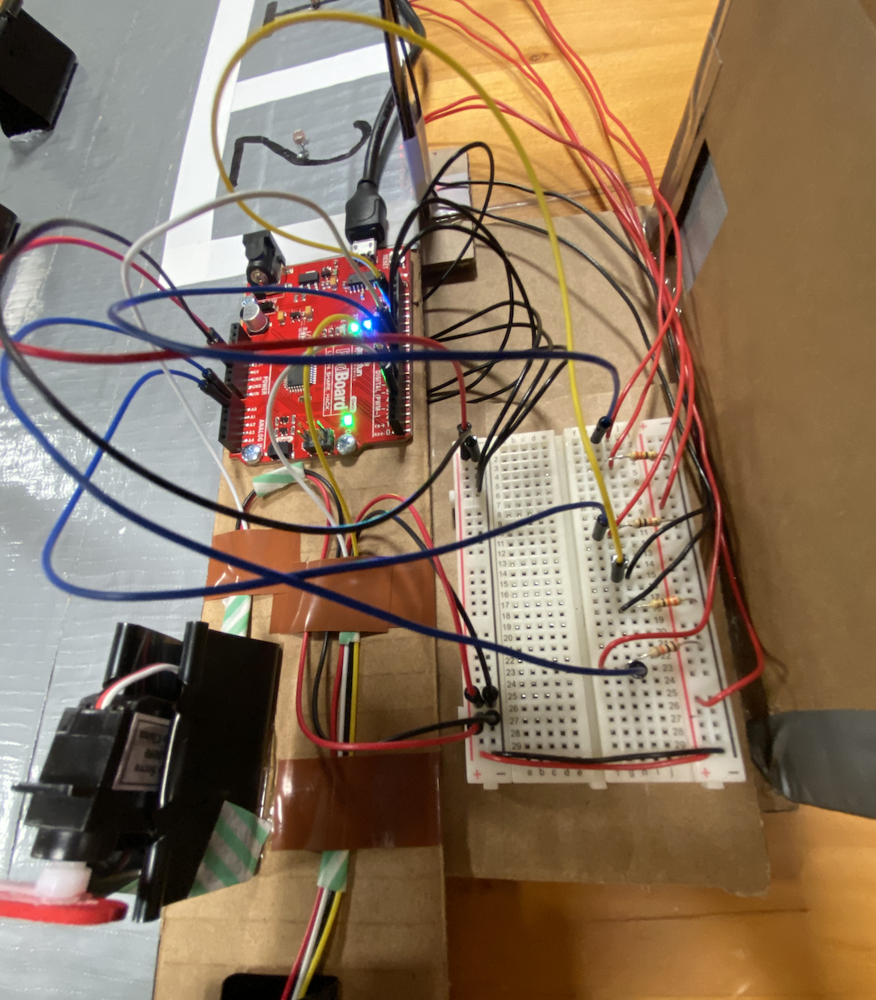

*** Car Parking System***

For my midterm prject I decided to use distance measuring sensor, servo motor, LED's and photoresistor. It was kind of challenging to come up with the projectt where I can use all the I/O, however after brainstorming I decided to use a cardboard and make a car parking system with a road and traffic light on the side, and decorate it with a duct tape. On the right side, I made a car barrier using distance measuring sensor and servo motor, and also used two LED's and two photoresistors to control the light - LED's stay on and when the car comes in and parks the light automatically turns off. On the left side of the cardboard I made a road using duct tape and traffic light using LED's. 

In order to build an Arduino Traffic Light Controller, I used:
- 3 x 330k resistor
- red, yellow and green LED's
- a breadboard
- wires

In order to make Automatic Smart Car Barrier System I used:
- distance measuring sensor
- servo motor
- wires
- a breadboard 
- paper clip 

In order to make LED's controlled with photoresistor I used:

- 2 LED's
- 2 photoresistors
- 2 x 10K ohm resistors
- 2 x 330k resistors
- wires
- a breadboard

Here is the photo of my project

Here are the photos of the circuit 

[Here](https://youtu.be/gnPDiSqWJoc) is the video of my wonderful project

At the beginning I decided to write the code in three different files; for traffic light, car barrier and LED's that are being controlled with photoresistors. And then after making sure that each of my code works fine, I decided to put all of them in one file, which was very challenging. Afterwards I decided to check everything one by one, with writing short codes and checking them, which helped a lot. 
Designing the project also took a lot of time - hot glueing parts, making ... to attach LED's and overall designing the board. 
I am actually satisfied with the project I have made for such a short period of time. After talking with my siblings, my brother asked me to give him my project so he could play with it, which I am very happy of. 
